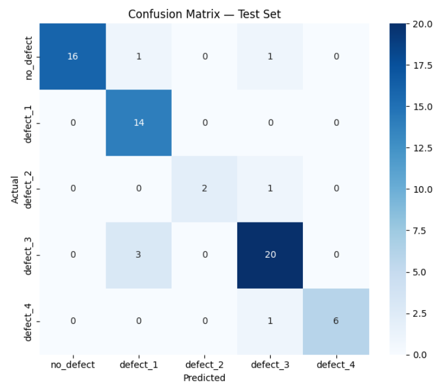

# Evaluation

## Confusion Matrix

## Classification Report on Test set

|         | precision  |  recall | f1-score |  support  |
|---------|------------|---------|----------|-----------|
| no_defect    |   1.00   |   0.89   |   0.94    |    18  |
| defect_1     |  0.78    |  1.00    |  0.88     |   14   |
| defect_2     |  1.00    |  0.67    |  0.80     |    3   |
| defect_3     |  0.87    |  0.87    |  0.87     |   23   |
| defect_4     |  1.00    |  0.86    |  0.92     |    7   |
|              |          |          |           |        |
| accuracy     |          |          |  0.89     |   65   |
| macro avg    |   0.93   |   0.86   |   0.88    |   65   |
| weighted avg |    0.91  |    0.89  |    0.89   |   65   |